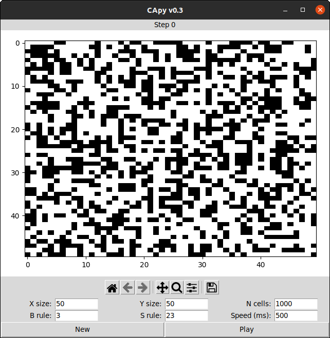

# CApy 

CApy is a 2D Cellular Automata fully implemented in Python based on Conway's
Game of Life.

**Author:** Nicolas Palacio-Escat

This work is licensed under a
[Creative Commons Attribution-ShareAlike 4.0 International License][cc-by-sa].

## Usage

CApy is built as a GUI (graphical user interface) application using `tkinter`.
It can either be opened by running the `main.py` script from a Python
interpreter (any platform) or by opening the binary executable file you can find
in the [releases](https://github.com/Nic-Nic/CApy/releases/latest) page
(currently only for Linux). Note that if you are running from the Python
interpreter, you need to install the required [dependencies](#dependencies).

The interface of CApy is pretty straightforward. First there is the graph space
where the status of the CA is shown. Black cells are "alive" or "on" while the
white ones represent "dead" cells or "off" state. The current iteration step is
shown above this area. Just below you can find the figure toolbar where you can
zoom, move, reset or even save the view of the current status. On the bottom of
the window you can define the X/Y size of the grid as well as the initial number
of cells. Here you can also define the speed as the time between iterations (in
miliseconds) as well as the survival and birth rules (S/B, more on this
[below](#rules)). Finally there are two buttons, "New" and "Play". The first
generates a new state for the CA based on the parameters and rules provided.
Cells are placed randomly across the available grid space following a uniform
distribution without replacement (i.e. a cell cannot be positioned where another
one already is). The "Play" button starts the simulation of the CA (or pauses it
if it is currently running).

## Rules

CA rules are defined by a list of digits between zero to eight. Each digit
determines the number of alive neighbors of a given cell (Moore's neighborhood)
where the rule applies. There are two main rules governing the behavior of the
CA:

- Birth (B): Dead cells that fulfill the given rule, will become alive in the
  next iteration, otherwise they remain dead.
- Survival (S): Alive cells that fulfill the given rule will keep on living in
  the next iteration, they will die otherwise.

Therefore, for instance, Conway's Game of Life rules are B3/S23, which means:

- Any dead cell surrounded by exactly three neighbors will become alive.
- Any alive cell surrounded by either two or three neighbors will survive,
  otherwise will die.

Note that there can be empty rules, for example B/S012345678 will produce a
static CA where cells with any number of neighbors survive but no new cells will
be generated (birth rule is empty).

## Dependencies

- [numpy](https://numpy.org/)
- [matplotlib](https://matplotlib.org/)

---

[![CC BY-SA 4.0][cc-by-sa-image]][cc-by-sa]

[cc-by-sa]: http://creativecommons.org/licenses/by-sa/4.0/
[cc-by-sa-image]: https://licensebuttons.net/l/by-sa/4.0/88x31.png
